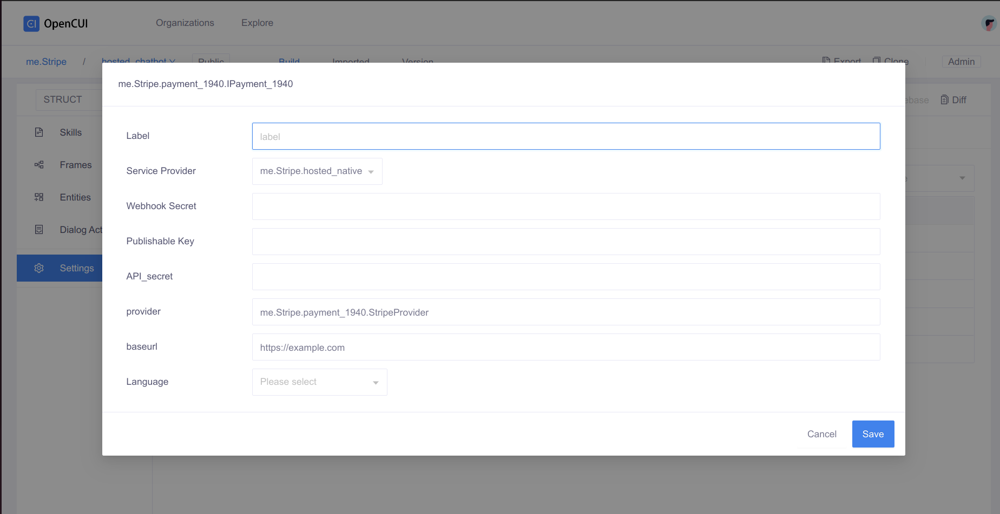

# Stripe Extension
The stripe extension provides a way to integrate with the Stripe payment gateway in your chatbot. It allows
you to charge your users for services and products using a chatbot interface aided by a web interface.

## Requirements
- Stripe account - [Create account](https://stripe.com/)
- Open Cui account - [Create Open CUI account](https://docs.google.com/forms/d/e/1FAIpQLSeYGRXfYnB_uDKTS4hUfcD3w1f9LDI9swcC5Qhy71PTS_JANA/viewform)

## Resources
- Open CUI documentation - [Open CUI documentation](https://opencui.io)
- Stripe documentation - [Stripe documentation](https://stripe.com/docs)
- Native provider - [Native provider](https://build.opencui.io/org/63845e6901beb60ccdfa1030/agent/6388909301beb60ccdfaeb32/service_schema)
- Component - [Component](https://build.opencui.io/org/63845e6901beb60ccdfa1030/agent/63885c4f01beb60ccdfad236/service_schema)

### setting up on Open CUI platform - For users()
> :warning: **⚠** The integration has not been set up to use the Open CUI platform. This will be updated in future with the relevant steps.


1. We need to understand extensions, please read the
   documentation [here](https://docs.opencui.io/docs/extensions/overview.html).
> Note: The OpenCUI is designed to have a open architecture, so that it is easy to
> make functionality available to chatbot. The core of this open architecture is separation
> between interface and implementation, so that conversational behavior
can be defined on the interface, while implementation can come in various form.

2. In summary, extensions are made in three steps:
   1. Define the interface
   2. Implement the interface
   3. Register the implementation

3. We need to import the following interface to the chatbot we wish to use this native provider.
   1. Go to the [component](https://build.opencui.io/org/63845e6901beb60ccdfa1030/agent/63885c4f01beb60ccdfad236/service_schema) page and import the component/service.
   2. To learn how to import, follow the documentation [here](https://opencui.io/reference/providers/extension.html#_5-wire-and-configure-in-chatbot).
   3. Go back to the chatbot , *click* **settings** and *click* **integrations** tab > **select Service**
   4. Select **me.Stripe.hosted_native**
      
   5. Fill in the required fields
      
   > To aquire the **secret key** and **publishable key** , go to your stripe account and navigate to
   > Developers > API keys
   > Webhooks can be aquired from the same page, but you need to create a webhook first.

   6. Click **Save**
   7. Go to **Skills** tab and *click* **Create**
   8. Create a new skill and *click* **Enter**
   9. Go to **Services** section and click **Select Service**
   10. Select **me.stripe.Payment_1940.IPayment_1940** > **Save**
   11. Go to **Responses** section and *click* **Select types of action** > *Select* **Single value message** > **Commit**
   12. Switch to **EN**
   13. In the **Response** tab, on the **Universal** section > *Add* **your payment is: ${payment_1940.getPaymentLink(30000, "usd")}**
   14. Move to the **Expression** and add **Names** and **Expressions** eg "test"

## Setting up the extension - For developers
1. We need to create a component that takes two parameters, the amount and the currency.
2. We export the Component and implement the interface.
3. We register the implementation.
4. We use the following configuration:
###### Provider class Name
eg `io.opencui.payment.StripeProvider`
This is the full name of the provider class, which is the name of the interface we are implementing.

###### Configuration meta
>> I think we might need to determine how to add a webhook url to the platform. Should be similar to the
>> one used in channels.

```json
[
   {
      "key": "webhook_secret",
      "label": "Webhook Secret",
      "type": "String"
   },
   {
      "key": "publishable_key",
      "label": "Publishable Key",
      "type": "String"
   },
   {
      "key": "api_secret",
      "label": "API_secret",
      "type": "String"
   },
   {
      "key": "provider",
      "label": "provider",
      "default_value": "me.Stripe.payment_1940.StripeProvider",
      "type": "String"
   },
   {
      "key": "baseurl",
      "label": "baseurl",
      "default_value": "https://example.com",
      "type": "String"
   },
   {
      "key": "Lang",
      "label": "Language",
      "placeholder": "Please select",
      "default_value": "en",
      "options": [
         {
            "value": "en",
            "label": "EN"
         },
         {
            "value": "zh",
            "label": "ZH"
         }
      ]
   }
]

```
###### Implementation

eg `io.opencui.extensions:stripe`

- Then we could follow a similar approach as one used by users to use this in our chatbot.


### Running locally
1. Clone the repository-[OpenCui](https://githib.com/opencui/runtime)
2. Export your agent to a zip file
3. Extract your agent in the `runtime`directory
4. Open your agent and run `gradle build`
5. Run the two services needed for dialogue understanding
```bash
docker run -it --rm -p 8000:8000 registry.cn-beijing.aliyuncs.com/ni/apps:0616-v1
docker run -it --rm -p 8501:8501 registry.us-east-1.aliyuncs.com/framely/apps:du.private--20220815--tag--du-debug-v10.3-v2.2
```
6. Run agent using the following command:
```bash
 java -Ddu.host=127.0.0.1 -Ddu.port=8501 -Dbot.prefix={org.botname} -Ddu.duckling=http://127.0.0.1:8080/parse -jar build/libs/dispatcher-1.1-SNAPSHOT.jar
 
 // org.botname eg me.Stripe.hosted_chatbot

```

